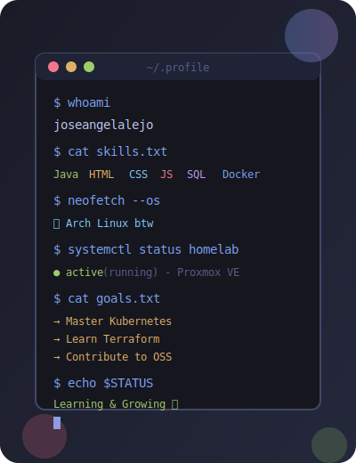

<div align="center">
  

  <h1>
    
    ¡Hola! Soy José Ángel
  </h1>

  <p>
    <strong>Full Stack Developer in Training</strong> | <strong>DAW Student</strong> | <strong>Spain</strong> 🇪🇸
  </p>

  <p>
    
  </p>

  <p>
    🚀 Actualmente estudiando <strong>DAW</strong> (Desarrollo de Aplicaciones Web) y profundizando en <strong>DevOps & GitOps</strong><br/>
    💻 Especializado en aplicaciones web con <strong>Java</strong>, <strong>JavaScript</strong> y bases de datos modernas<br/>
    🐧 Entusiasta de Linux usando <strong>Linux</strong> como driver diario y <strong>Proxmox VE</strong> para mi homelab<br/>
    🎯 Metas 2026: Aprender <strong>Kubernetes</strong>, <strong>Terraform & Ansible</strong>, y contribuir a Open Source
  </p>

  <p>
    <a href="https://github.com/joseangelalejo">
      
    </a>
    <a href="https://github.com/joseangelalejo">
      
    </a>
    <a href="https://www.linux.org/">
      
    </a>
  </p>
</div>

---

## 🛠️ **Tech Stack**

<div align="center">

### **Lenguajes**
<p>
  
  
  
  
</p>

### **Bases de Datos**
<p>
  
  
</p>

### **Herramientas & IDEs**
<p>
  
  
  
  
  
</p>

### **Sistemas Operativos**
<p>
  
  
  
</p>

### **DevOps & Contenedores**
<p>
  
  
</p>

</div>

---

## 📚 **Actualmente Aprendiendo**

<div align="center">

```text
🎓 Grado Superior DAW           ██████████░░░░░░░░░░░   50%
🔄 GitOps (LFS169)              ███████████████░░░░░░   70%
🚀 DevOps (LFS162)              ████░░░░░░░░░░░░░░░░░   20%
```

</div>

---

## 💼 **Proyectos Destacados**

<div align="center">

[](https://github.com/joseangelalejo/MisApuntesITPDAW)

</div>

<table>
  <tr>
    <td width="120" align="center">
      
    </td>
    <td>
      <h3>🎮 CS2-SVSS Fragify</h3>
      <p><em>Sistema de Visualización de Estadísticas de Counter-Strike 2</em></p>
      <p>Sistema backend para recopilar y visualizar estadísticas de jugadores de CS2 mediante integración con <strong>Steam API</strong>. Incluye gestión de <strong>rankings ELO</strong>, histórico de partidas, estadísticas detalladas y sistema de reportes. Desplegado en mi <strong>homelab</strong> con <strong>Proxmox VE</strong>. <strong>Frontend en desarrollo</strong>.</p>
      <p>
        
        
        
        
      </p>
    </td>
  </tr>
  <tr>
    <td width="120" align="center">
      
    </td>
    <td>
      <h3>📊 JSON/CSV Data Visualizer</h3>
      <p><em>Aplicación web de visualización de datos moderna</em></p>
      <p>Aplicación web moderna y elegante para explorar archivos <strong>JSON/CSV</strong> y conexiones a bases de datos (<strong>SQLite</strong>, <strong>PostgreSQL</strong>, <strong>MySQL</strong>, <strong>MongoDB</strong>). Incluye tablas interactivas, gráficos dinámicos, diagramas ER y exportación a CSV. Interfaz moderna con gradientes vibrantes, diseño responsivo y tema automático. Desplegada con <strong>Docker</strong> y <strong>nginx</strong> para producción, con seguridad avanzada (JWT, rate limiting, headers de seguridad).</p>
      <p>
        
        
        
        
        
      </p>
    </td>
  </tr>
</table>

---

## 📬 **Contacto**

<div align="center">

<a href="https://www.linkedin.com/in/joseangelalejosillero/">
  
</a>
<a href="https://discord.com/users/joseangelalejo">
  
</a>
<a href="mailto:joseangelcorptiv@gmail.com">
  
</a>

</div>

---

## 🏆 **Logros**

<div align="center">


</div>

---

## 💡 **Dato Curioso**

<div align="center">


</div>

---

## 📊 **Estadísticas de GitHub**

<div align="center">


</div>

---

## 📈 **Métricas de GitHub**

<div align="center">


<em>Generado automáticamente con GitHub Actions workflow.</em>

</div>

---

## 🐍 **Serpiente de Contribuciones**

<div align="center">


<em>Generado automáticamente con GitHub Actions workflow.</em>

</div>

---

<div align="center">

**¡Gracias por visitar mi perfil!** 🚀

</div>
