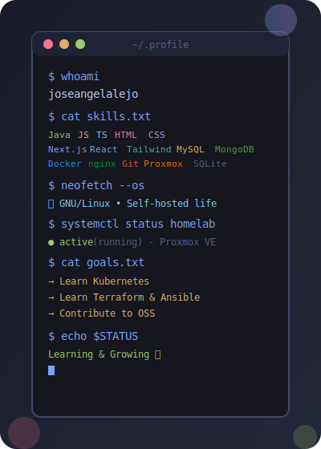
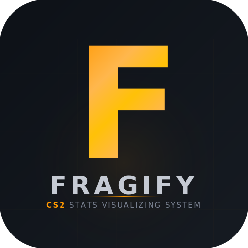

### Hey! 

[](https://git.io/typing-svg)

├── &nbsp;&nbsp; I'm a **Full Stack Developer in Training** from Spain, currently studying **DAW** (Web Application Development) and diving deep into **DevOps & GitOps**.

├── &nbsp;&nbsp; I specialize in building web applications with **Java**, **JavaScript**, and modern databases.

├── &nbsp;&nbsp; Linux enthusiast running **Linux** as my daily driver and **Proxmox VE** for my homelab.

└── &nbsp;&nbsp; 2026 Goals: Learn **Kubernetes**, **Terraform & Ansible**, and contribute to Open Source.

[](https://github.com/joseangelalejo) [](https://github.com/joseangelalejo) [](https://www.linux.org/)

<br clear="left"/>

---

####  **Tech Stack**

| Category                | Technologies                                                                                                                                                                                                                                                                                                                                                                                                                                                                                                                                                                                                                                            |
|-------------------------|--------------------------------------------------------------------------------------------------------------------------------------------------------------------------------------------------------------------------------------------------------------------------------------------------------------------------------------------------------------------------------------------------------------------------------------------------------------------------------------------------------------------------------------------------------------------------------------------------------------------------------------------------------|
| **Languages**           | <a href="https://openjdk.org" target="_blank" rel="noopener noreferrer"></a> <a href="https://developer.mozilla.org/en-US/docs/Web/JavaScript" target="_blank" rel="noopener noreferrer"></a> <a href="https://www.typescriptlang.org" target="_blank" rel="noopener noreferrer"></a> <a href="https://developer.mozilla.org/en-US/docs/Web/HTML" target="_blank" rel="noopener noreferrer"></a> <a href="https://developer.mozilla.org/en-US/docs/Web/CSS" target="_blank" rel="noopener noreferrer"></a> |
| **Frameworks & Libraries** | <a href="https://nextjs.org" target="_blank" rel="noopener noreferrer"></a> <a href="https://react.dev" target="_blank" rel="noopener noreferrer"></a> <a href="https://tailwindcss.com" target="_blank" rel="noopener noreferrer"></a> <a href="https://recharts.org" target="_blank" rel="noopener noreferrer"></a> <a href="https://tanstack.com/table/v8" target="_blank" rel="noopener noreferrer"></a> <a href="https://microsoft.github.io/monaco-editor/" target="_blank" rel="noopener noreferrer"></a> <a href="https://d3js.org" target="_blank" rel="noopener noreferrer"></a> <a href="https://www.papaparse.com" target="_blank" rel="noopener noreferrer"></a> <a href="https://github.com/taozhi8833998/node-sql-parser" target="_blank" rel="noopener noreferrer"></a> |
| **Databases**           | <a href="https://www.mysql.com" target="_blank" rel="noopener noreferrer"></a> <a href="https://mariadb.org" target="_blank" rel="noopener noreferrer"></a> <a href="https://www.postgresql.org" target="_blank" rel="noopener noreferrer"></a> <a href="https://www.mongodb.com" target="_blank" rel="noopener noreferrer"></a> <a href="https://www.sqlite.org" target="_blank" rel="noopener noreferrer"></a> |
| **Tools & IDEs**        | <a href="https://code.visualstudio.com" target="_blank" rel="noopener noreferrer"></a> <a href="https://netbeans.apache.org" target="_blank" rel="noopener noreferrer"></a> <a href="https://git-scm.com" target="_blank" rel="noopener noreferrer"></a> <a href="https://github.com" target="_blank" rel="noopener noreferrer"></a> <a href="https://maven.apache.org" target="_blank" rel="noopener noreferrer"></a> |
| **Operating Systems**   | <a href="https://www.linux.org" target="_blank" rel="noopener noreferrer"></a> <a href="https://www.microsoft.com/windows" target="_blank" rel="noopener noreferrer"></a> <a href="https://www.proxmox.com" target="_blank" rel="noopener noreferrer"></a> |
| **DevOps & Containers** | <a href="https://www.docker.com" target="_blank" rel="noopener noreferrer"></a> <a href="https://nginx.org" target="_blank" rel="noopener noreferrer"></a> <a href="https://www.gitops.tech" target="_blank" rel="noopener noreferrer"></a> |

---

####  **Currently Learning**

```text
🎓 Grado Superior DAW           ██████████░░░░░░░░░░░   50% 
🔄 GitOps (LFS169)              ███████████████░░░░░░   70%
🚀 DevOps (LFS162)              ████░░░░░░░░░░░░░░░░░   20%
```

---

####  **Projects**

<div align="center">

[](https://github.com/joseangelalejo/MisApuntesITPDAW)

</div>

<table>
<tr>
<td width="100" align="center">

</td>
<td>

**CS2-SVSS Fragify** — *Counter-Strike 2 Stats Visualizing System*

Sistema backend para recopilar y visualizar estadísticas de jugadores de CS2 mediante integración con **Steam API**. Incluye gestión de **rankings ELO**, histórico de partidas, estadísticas detalladas y sistema de reportes. Desplegado en mi **homelab** con **Proxmox VE**. **Frontend en desarrollo**.

<a href="https://www.mysql.com" target="_blank" rel="noopener noreferrer"></a> <a href="https://standards.ieee.org/standard/830-1998.html" target="_blank" rel="noopener noreferrer"></a> <a href="https://gdpr.eu" target="_blank" rel="noopener noreferrer"></a> <a href="https://www.proxmox.com" target="_blank" rel="noopener noreferrer"></a>

</td>
</tr>
<tr>
<td width="150" align="center">
<a href="https://github.com/joseangelalejo/json-csv-visualizerv1" title="Data Explorer & Web IDE">

</a>
</td>
<td>

**Data Explorer & Web IDE** — *Explorador de datos, conexión a bases y editor web integrado*

Aplicación web para explorar archivos **JSON/CSV** y conectar con servidores de bases de datos (**SQLite**, **PostgreSQL**, **MySQL**, **MongoDB**). Permite navegar esquemas y tablas, ver y filtrar datos en tablas interactivas, ejecutar y editar consultas desde un **IDE web (Monaco Editor)**, generar gráficos dinámicos y diagramas ER, y exportar resultados a CSV. Desplegada con **Docker** y **nginx**; incluye seguridad avanzada (JWT, rate limiting, CSP headers) y soporte para múltiples motores de BD.

<a href="https://nextjs.org" target="_blank" rel="noopener noreferrer"></a> <a href="https://react.dev" target="_blank" rel="noopener noreferrer"></a> <a href="https://www.typescriptlang.org" target="_blank" rel="noopener noreferrer"></a> <a href="https://tailwindcss.com" target="_blank" rel="noopener noreferrer"></a> <a href="https://www.docker.com" target="_blank" rel="noopener noreferrer"></a>

</td>
</tr>
</table>

---

####  **Contact Me**

<div align="center">

[](https://www.linkedin.com/in/joseangelalejosillero/) [](https://discord.com/users/joseangelalejo) [](mailto:joseangelcorptiv@gmail.com)

</div>

---

#### 🏆 **Achievements**

<div align="center">

   

</div>

---

####  **Fun Fact**

<div align="center">

[](https://github.com/piyushsuthar/github-readme-quotes)

</div>

---

####  **GitHub Stats**

<div align="center">


[](https://git.io/streak-stats)

</div>

---

####  **GitHub Metrics**

<div align="center">


*Generated automatically with GitHub Actions workflow.*

</div>

---

####  **Contribution Snake**

<div align="center">


*Generated automatically with GitHub Actions workflow.*

</div>

---
